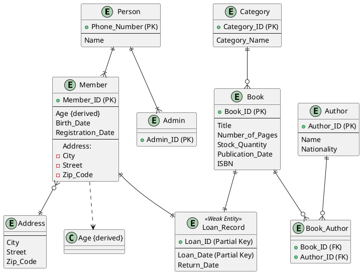

**Course Project Technical Report**

Version 0.4

Fall 2024

**Team (Project) Name:**

Project-24

**Team Members:**

| **Student Name** | **Student-ID** |
| :--------------: | :------------: |
|   Jiarui Xing    |   A01354731    |

# About the Project 
## Project Goal
The project activity aims to provide this opportunity to create a database system from the beginning to the database development. In this project, you will:

1. Come up with a universe of discourse and a corresponding conceptual model
2. Convert your conceptual model to a relational model
3. Use a SQL product (such as MySQL) to create your database, populate it with some data and write some DML statements
4. Normalize your database schema

The project could be done in groups of up to 4 people. Depending on the number of people in the group the scope of the project would change. 

## Project Evaluation
Each Milestone will be evaluated independently. 

Once you join a group, it is expected to stay in the group until the end of the project.

The project final grade for each individual will be based on the following metrics:

1. The completion of the Milestones 1-4 on time and completeness of this technical report
1. Evaluation of teammates in a group

## Project Timeline

| **Milestones** | **Due date** |
| :------------- | :----------- |
| Milestone 1    | 2024.11.29   |
| Milestone 2    | 2024.11.29   |
| Milestone 3    | 2024.11.29   |
| Milestone 4    | 2024.11.30   |

# Milestone1

- You need to describe a mini world. 
- You can come up with a new idea for the mini-world or describe an existing application. 
- A good mini-world is one with a conceptual model including all the topics we have studied in Module 1:
  - Entities, Weak entities, Total and partial participation, Classes and sub-classes, composite attributes, derived attributes, super/subclasses, …
- The conceptual model in 2 formats (ER/EER) and UML Class Notation
  - UML Notation is Optional (for practice only).

**Note:** The scope of the project is adjusted based on how many people work on a project in a group.

If you work individually (in groups of 1) on this project:

- Then, between 8-10+ entity types are expected in your conceptual model.

If you work in a group of 2 on the project:

- Then, it is expected that there will be between 12 and 15+ entity types in your conceptual model.

If you work in a group of 3/4 on the project:

- Then, between 18-20+ entity types are expected in your conceptual model.

## Milestone1-Task1: Universe of Discourse (Mini-World) Description
The library management system is designed to efficiently manage various library resources and services efficiently, ensuring the smooth operation of functions such as book borrowing, returning, inventory management, and member management. The primary users of the system include library administrators and members.
## Milestone1-Task2: Conceptual Design using ER/EER Diagram
图书馆管理系统EER图描述

1. 实体（Entities）

1.1 Person（人员）

属性（Attributes）：

Phone_Number（电话号，主键，PK）

Name（姓名）

说明：

Person 实体作为超类，包含所有用户的共性属性，如电话号码和姓名。

1.2 Member（会员）

属性（Attributes）：

Member_ID（会员编号，主键，PK）

Phone_Number（电话号，外键，FK，关联到 Person.Phone_Number）

Birth_Date（出生日期）

Registration_Date（注册日期）

City（城市）

Street（街道）

Zip_Code（邮政编码）

派生属性（Derived Attributes）：

Age（年龄）— 由 Birth_Date 计算得出

说明：

Member 实体继承自 Person，拥有自己的主键 Member_ID 以及外键 Phone_Number，表示每个会员都是一个人员。

Address（地址）被拆分为 City、Street 和 Zip_Code 作为独立属性。

1.3 Admin（管理员）

属性（Attributes）：

Admin_ID（管理员编号，主键，PK）

Phone_Number（电话号，外键，FK，关联到 Person.Phone_Number）

说明：

Admin 实体继承自 Person，拥有自己的主键 Admin_ID 以及外键 Phone_Number，表示每个管理员都是一个人员。

1.4 Book（图书）

属性（Attributes）：

Book_ID（图书编号，主键，PK）

Title（书名）

Number_of_Pages（页数）

Stock_Quantity（库存数量）

Publication_Date（出版日期）

ISBN（国际标准书号）

Category_ID（类别编号，外键，FK，关联到 Category.Category_ID）

说明：

Book 实体包含图书的详细信息，每本书通过 Category_ID 关联到其所属的类别。

1.5 Author（作者）

属性（Attributes）：

Author_ID（作者编号，主键，PK）

Name（姓名）

Nationality（国籍）

说明：

Author 实体记录作者的基本信息。

1.6 Category（类别）

属性（Attributes）：

Category_ID（类别编号，主键，PK）

Category_Name（类别名称）

说明：

Category 实体用于分类图书，每个类别包含多个图书。

1.7 Loan_Record（借阅记录） (弱实体)

属性（Attributes）：

Member_ID（会员编号，主键部分，PK，FK，关联到 Member.Member_ID）

Book_ID（图书编号，主键部分，PK，FK，关联到 Book.Book_ID）

Loan_Date（借书日期，主键部分，PK）

Return_Date（归还日期）

说明：

Loan_Record 是一个弱实体，依赖于 Member 和 Book 实体，通过组合键 (Member_ID, Book_ID, Loan_Date) 唯一标识一条借阅记录。

1.8 Book_Author（图书作者关联） (关联实体)

属性（Attributes）：

Book_ID（图书编号，主键部分，PK，FK，关联到 Book.Book_ID）

Author_ID（作者编号，主键部分，PK，FK，关联到 Author.Author_ID）

说明：

Book_Author 实体用于解决 Book 与 Author 之间的多对多关系，每条记录表示一本书由一位作者撰写。

1.9 Address（地址） (复合属性)

属性（Attributes）：

City（城市）

Street（街道）

Zip_Code（邮政编码）

说明：

Address 被作为 Member 的复合属性，拆分为 City、Street 和 Zip_Code，便于管理和查询。

2. 关系（Relationships）

2.1 泛化/继承关系（Generalization/Specialization）

Person 是超类，Member 和 Admin 是其子类。

说明：

通过继承关系，Member 和 Admin 继承了 Person 的属性（Phone_Number 和 Name）。

2.2 Writes（撰写）

类型：多对多（M:N）

参与实体：Author 和 Book

关联实体：Book_Author

说明：

一个作者可以撰写多本书，一本书可以由多位作者撰写。通过 Book_Author 实体实现多对多关系。

2.3 Belongs_To（属于）

类型：多对一（M:1）

参与实体：Book 和 Category

说明：

每本书属于一个类别，每个类别可以包含多本书。Book 实体通过 Category_ID 关联到 Category 实体。

2.4 Borrows（借阅）

类型：一对多（1:M）

参与实体：Member 和 Loan_Record

说明：

一个会员可以有多条借阅记录，每条借阅记录对应一个会员。Loan_Record 实体通过 Member_ID 关联到 Member 实体。

2.5 Involves（涉及）

类型：一对多（1:M）

参与实体：Book 和 Loan_Record

说明：

一本书可以被多次借阅，每条借阅记录涉及一本书。Loan_Record 实体通过 Book_ID 关联到 Book 实体。

2.6 Has（拥有）

类型：一对一（1:1）

参与实体：Member 和 Address

说明：

一个会员拥有一个地址，地址由 City、Street 和 Zip_Code 组成。Member 实体通过 Address_ID 关联到 Address 实体。
## Milestone1-Task3: Conceptual Design using UML Notation [Optional but Recommended]

## Milestone1-Task4: Defining functional dependencies in your mini-world
If you work individually (in groups of 1) on this project:

- Then, it is expected to have between 4+ functional dependencies in your mini-world.

If you work in a group of 2 on the project:

- Then, it is expected to have between 6+ functional dependencies in your mini-world.

If you work in a group of 3/4 on the project:

- Then, it is expected to have between 7+ functional dependencies in your mini-world.

**List all functional dependencies here. Make sure to include visuals as discussed during the lecture:**
1. Primary-Key Functional Dependencies: List them here:
    - Phone_Number → Name
    - Member_ID → Phone_Number, Age, Birth_Date, Registration_Date, Address
    - Admin_ID → Phone_Number
    - Book_ID → Title, Number_of_Pages, Stock_Quantity, Publication_Date, ISBN, Category_ID
    - Author_ID → Name, Nationality
    - Category_ID → Category_Name
    - (Loan_ID, Loan_Date) → Return_Date, Member_ID, Book_ID
2. Partial Functional Dependencies: List them here
    - Phone_Number → Name
3. Transitive Functional Dependencies: List them here
    - Member_ID → Phone_Number
    - Phone_Number → Name
    - **传递依赖**：Member_ID → Name
    - Book_ID → Category_ID
    - Category_ID → Category_Name
    - **传递依赖**：Book_ID → Category_Name
# Milestone2

In Milestone 2, you are going to continue working on what you have done in Milestone1. 

## Milestone2-Task1: Updated Universe of Discourse (Mini-World) Description
- [Optional]: If your mini-world needs to be updated for any reasons, you have the chance to update it here. Please notice, if the original version of the mini-World is not comprehensive enough (having different types of entities and relationships and … and enough number of entities), you need to update the original mini-World and submit it in this Milestone.

- The Milestone2-Task1 is not going to be graded, yet an update is a must if needed based on the comment above. Please also see Task 3 below.

No update

## Milestone2-Task2: Updated Conceptual Design
- If an update to the Conceptual design is needed, please do it and add it here. (Particularly If you have to update your original mini-world in Task1 above)

No update

## Milestone2-Task3: Updating functional dependencies in your mini-world
If you work individually (groups of 1) on this project:

- Then, it is expected to have between 4+ functional dependencies in your mini-world.

If you work in a group of 2 on the project:

- Then, it is expected to have between 6+ functional dependencies in your mini-world.

If you work in a group of 3/4 on the project:

- Then, it is expected to have between 7+ functional dependencies in your mini-world.

**Note**: If you cannot extract enough functional dependencies in your mini-world, you will need to update it and submit it under Milestone2-Task1.

No update

## Milestone2-Task4: Creating the relational model of your conceptual model
- You need to create the relational models following the steps we defined in the lecture.

**Relations**  
Person: [Phone_Number, Name]  
Member: [Member_ID, Phone_Number, Birth_Date, Registration_Date, City, Street, Zip_Code]  
Admin: [Admin_ID, Phone_Number]  
Book: [Book_ID, Title, Number_of_Pages, Stock_Quantity, Publication_Date, ISBN, Category_ID]  
Author: [Author_ID, Name, Nationality]  
Category: [Category_ID, Category_Name]  
Loan_Record: [Member_ID, Book_ID, Loan_Date, Return_Date]  
Book_Author: [Book_ID, Author_ID]

**Foreign Keys**  
Member.Phone_Number references Person.Phone_Number  
Admin.Phone_Number references Person.Phone_Number  
Book.Category_ID references Category.Category_ID  
Loan_Record.Member_ID references Member.Member_ID  
Loan_Record.Book_ID references Book.Book_ID  
Book_Author.Book_ID references Book.Book_ID  
Book_Author.Author_ID references Author.Author_ID
# Milestone3
In Milestone 3, In Milestone 3 you are doing to work with the database that you have designed.

**Note:** By the end of Milestone 2, it is expected that you have designed your relational model (database). 

## Milestone3-Task1: Update your conceptual and relational models
If you have received any feedback from the evaluator of Milestone 1 and 2, that you need to make some changes in your conceptual and relation models, you need to do it now and insert the updated answer:

## Milestone3-Task1: Create your database schema
- Please use the SQL DDL statements to create your database schema. 
- Provide a name for each table.
- Include all attributes
- Define PK and FK.
- Please add a snapshot of the statement you have written and the results

**[Write your answer here]**

## Milestone3-Task2: Populate your tables with some sample data
- Insert some sample data to your tables 
- The volume of inserted data is not important. Just insert enough amount of data that makes sense for your project.
- Please add a snapshot of the tables with some data in them

**[Write your answer here]**

## Milestone3-Task3: Write SQL Statement
- You need to define several use-cases and write their corresponding queries.
- At least 10 queries should be written
- For group of 2 or more people, in addition to the first 10 queries, for each group member you need to add extra 3 use-cases.
- Write the SQL Statements, run them and take a snapshot from the results and insert them here.
- So the following items are expected:
1. The usecase
1. The SQL query
1. The screenshot of the data  

Example:

1. Use case: As an admin, I need to know the name and SSN of the managers of all department.
1. SQL Statement: Please see below
1. Snapshot: Please see below

**[Write your answer here]**

# Milestone4
In Milestone 4, you are going to normalize the database (relational model) you have developed in Milestone 2.

**Note:** It is expected in this Milestone to change the relational model you have completed in Milestone 2 and consequently the database you have developed in Milestone 3. While it is expected to normalize your database schema in this milestone, it is not expected you to re-create your database and update the sql statements you have developed in module 3.

## Milestone4-Task1:Identify full, partial and transitive functional dependencies in your design
- In Module 4, we learned about full, partial and transitive functional dependencies and we discussed how normalization process deals with such functional dependencies. 

- The Milestone4-Task1: List all functional dependencies you have identified in Milestone 2. For each functional dependency identify whether it is full, partial or transitive functional dependencies and briefly explain why. Complete the following table. (Expand the table as needed)

<table>  <tr><th colspan="1" valign="top">Functional Dependency</th><th colspan="1" rowspan="2" valign="top"></th></tr>
  <tr><td colspan="1" valign="top">Partial, full or transitive? And why</td></tr>
  <tr><td colspan="1" valign="top">Functional Dependency</td><td colspan="1" rowspan="2" valign="top"></td></tr>
  <tr><td colspan="1" valign="top">Partial, full or transitive? And why</td></tr>
</table>

## Milestone4-Task2: Highest Normal Form
- Take your relational models and test them against the Normalization tests and complete this section:

Relation NOT in 1NF: (List all relations that are NOT even in 1NF, if any):

Relation with 1NF as highest normal form: (List all relations that are in 1NF but not 2NF)

Relation with 2NF as highest normal form: (List all relations that are in 2NF but not 3NF)

Relation with 3NF as highest normal form: (List all relations that are in 3NF but not BCNF)

Relation with BCNF as highest normal form:

## Milestone4-Task3: Converting to 3NF
In this task you will normalize all your relations to 3NF and BCNF. If a relation is already in BCNF or 3NF, no change is needed.

## Milestone4-Task4: Converting to BCNF
In this task you will normalize all your relations to BCNF. If a relation is already in BCNF, no change is needed.

- Check whether there are any functional dependencies that are not preserved as a result of normalization to BCNF.
