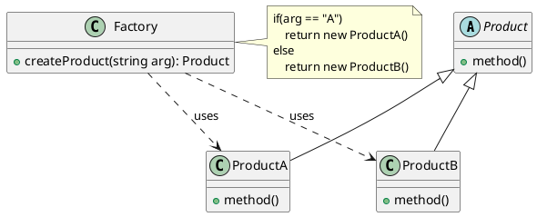

## 总结
### 概述
工厂模式通过创建工厂类来负责对象的创建，客户端通过工厂类获取所需的对象，避免了直接使用 `new` 关键字，提高了代码的灵活性和可维护性
### 简单工厂模式
通常是创建某一大类下面不同类的实例的一种模式
### 实现
```java
public class SimpleFactory {  
    public static Product createProduct(String type)  
    {  
        if("A".equals(type))  
        {  
            return new ProductA();  
        } else if("B".equals(type))  
        {  
            return new ProductB();  
        } else  
        {  
            return null;  
        }  
    }  
}  
  
// 产品大类  
public abstract class Product {  
    public abstract void show();  
}  
  
// 产品A  
class ProductA extends Product {  
    @Override  
    public void show()  
    {  
        System.out.println("Product A");  
    }  
}  
  
// 产品B  
class ProductB extends Product {  
    @Override  
    public void show()  
    {  
        System.out.println("Product B");  
    }  
}
```
### 应用
- 当一个类不知道它所需要的对象的类时
- 当一个类希望由子类来指定它所创建的对象时
	- 需要由一个知道所有"产品"的"工厂类"决定哪一个"产品"类被实例化

---
## 定义
- 又称静态工厂方法模式(Static Factory Method Pattern)
- 专门定义一个工厂类, 负责根据参数的不同返回不同类的实例
	- 被创建的实例通常具有共同的父类
- 是工厂模式中最简单实用的模式
## 原理类图

- Product: 抽象产品类, 表明了产品的"大类", 如 Pizza, 下面可以包含 PepperPizza, CheesePizza 等具体子类
- ProductA, ProductB: 具体的子类
- Factory: 工厂类, 包含 `createProduct()` 方法, 根据接收到的需求产品类型来创建对应产品类的实例
```java
// 工厂类: 根据接受参数实例化对应产品
public class SimpleFactory {  
    public static Product createProduct(String type)  
    {  
        if("A".equals(type))  
        {  
            return new ProductA();  
        } else if("B".equals(type))  
        {  
            return new ProductB();  
        } else  
        {  
            return null;  
        }  
    }  
  
    public static void main(String[] args)  
    {  
        Product product = SimpleFactory.createProduct("A");  
        if(product != null)  
        {  
            product.show();  
        } else  
        {  
            System.out.println("Product is null");  
        }  
    }  
}  
  
// 产品大类  
public abstract class Product {  
    public abstract void show();  
}  
  
// 产品A  
class ProductA extends Product {  
    @Override  
    public void show()  
    {  
        System.out.println("Product A");  
    }  
}  
  
// 产品B  
class ProductB extends Product {  
    @Override  
    public void show()  
    {  
        System.out.println("Product B");  
    }  
}
```
## 特点
### 优点
- 对象的创建和使用分离
	- 由工厂类完全负责对象的创建, 客户端不需要关心如何创建, 只需要关心如何使用
### 缺点
- 不够灵活, 新增产品需要修改工厂类