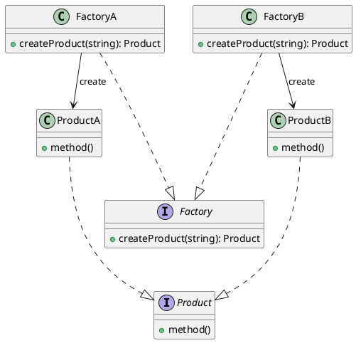

## 总结
### 概述
将简单工厂的核心工厂类变成一个抽象接口, 接口负责给出工厂类应该实现的方法; 不再负责创建产品类实例, 而是将具体产品类实例的初始化工作交给核心工厂的子类, 即子工厂类
### 实现
```java
public class SimpleFactory {  
    public static Product createProduct(String type)  
    {  
        if("A".equals(type))  
        {  
            return new ProductA();  
        } else if("B".equals(type))  
        {  
            return new ProductB();  
        } else  
        {  
            return null;  
        }  
    }  
}  
  
// 产品大类  
public abstract class Product {  
    public abstract void show();  
}  
  
// 产品A  
class ProductA extends Product {  
    @Override  
    public void show()  
    {  
        System.out.println("Product A");  
    }  
}  
  
// 产品B  
class ProductB extends Product {  
    @Override  
    public void show()  
    {  
        System.out.println("Product B");  
    }  
}
```
### 应用
- 当一个类不知道它所需要的对象的类时
- 当一个类希望由子类来指定它所创建的对象时
	- 需要由一个知道所有"产品"的"工厂类"决定哪一个"产品"类被实例化

---
## 定义
- 定义一个用于创建对象的接口, 让子类决定实例化哪个类
	- 产品类的实例化操作延迟到工厂子类中完成
## 原理类图

- Factory: 工厂类接口, 定义了工厂类应包含的实例化方法
- FactoryA, FactoryB: 工厂类, 实现具体的 `createProduct()` 方法, 根据接收到的需求产品类型来创建对应产品类的实例
- Product: 抽象产品类, 表明了产品的"大类", 如 Pizza, 下面可以包含 PepperPizza, CheesePizza 等具体子类
- ProductA, ProductB: 具体的子类

```java
// 工厂接口: 定义工厂类应该实现的方法
public interface Factory {  
    public Product createProduct(String arg);  
}

// 工厂类A
public class FactoryA implements Factory {  
    @Override  
    public Product createProduct(String arg)  
    {  
        if("A".equals(arg))  
        {  
            return new ProductA();  
        } else  
        {  
            throw new IllegalArgumentException("不支持" + arg);  
        }  
    }  
}

// 工厂类B
public class FactoryB implements Factory {  
    @Override  
    public Product createProduct(String arg)  
    {  
        if("B".equals(arg))  
        {  
            return new ProductB();  
        } else  
        {  
            throw new IllegalArgumentException("不支持" + arg);  
        }  
    }  
}

// 产品接口: 定义产品实现方法
public interface Product {  
    public void method();  
}

// 产品A  
public class ProductA implements Product {  
    @Override  
    public void method()  
    {  
        System.out.println("ProductA 的方法被调用");  
    }  
}
  
// 产品B  
public class ProductB implements Product {  
    @Override  
    public void method()  
    {  
        System.out.println("ProductB 的方法被调用");  
    }  
}

// 客户端
public class Main {  
    public static void main(String[] args)  
    {  
        // 使用 FactoryA 创建 ProductA
        Factory factoryA = new FactoryA();
        Product productA = factoryA.createProduct("A");
        productA.method();

        // 使用 FactoryB 创建 ProductB
        Factory factoryB = new FactoryB();
        Product productB = factoryB.createProduct("B");
        productB.method();
    }
}
```
## 特点
### 优点
- 对象的创建和使用分离
	- 由工厂类完全负责对象的创建, 客户端不需要关心如何创建, 只需要关心如何使用
### 缺点
- 不够灵活, 新增产品需要修改工厂类