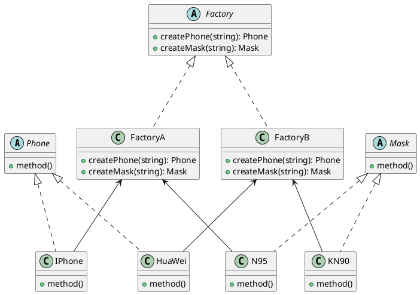

## 总结
### 概述
将工厂模式的工厂接口扩展到工厂与产品一对多的关系
相当于将工厂模式的
- 富士康工厂
	- 华为工厂
		- 华为
	- 苹果工厂
		- 苹果
扩展为
- 大型工厂
	- 富士康超级工厂
		- 手机
			- 华为
			- 苹果
		- 口罩
			- N 95 
			- 一次性
	- 广东工厂
		- 手机
			- 华为
			- 苹果
		- 口罩
			- N 95 
			- 一次性
- 若抽象工厂模式只有一套产品体系, 则退化为工厂模式
### 实现
```java
// 抽象工厂
interface AbstractFactory {
    Phone createPhone(String param);
    Mask createMask(String param);
}

// 具体工厂
class SuperFactory implements AbstractFactory {
    @Override
    public Phone createPhone(String param) {
        return new iPhone();
    }

    @Override
    public Mask createMask(String param) {
        return new N95();
    }
}

// 产品大类—手机
interface Phone { }
class iPhone implements Phone { }

// 产品大类—口罩
interface Mask { }
class N95 implements Mask { }
```
### 应用
- 当一个类不知道它所需要的对象的类时
- 当一个类希望由子类来指定它所创建的对象时
	- 需要由一个知道所有"产品"的"工厂类"决定哪一个"产品"类被实例化

---
## 定义
- 抽象工厂模式将工厂模式的工厂接口扩展为适应多个产品体系的抽象工厂
## 结构
- 工厂接口
- 工厂类
- 产品 A接口
- 产品 A类
- 产品 B 接口
- 产品 B 类
## 原理类图

- Factory: 工厂类接口, 定义了工厂类应包含的实例化方法, 包含了多个产品实现方法
- FactoryA, FactoryB: 工厂类, 实现具体的产品实现方法, 根据接收到的需求产品类型来创建对应产品类的实例
- Phone, Mask: 抽象产品类, 表明了产品的"大类"
- IPhone, HuaWei, N 95, KN 90: 产品的具子类

```java
// 抽象产品类 Phone
abstract class Phone {
    public abstract void method();
}

// 具体产品类 IPhone
class IPhone extends Phone {
    @Override
    public void method() {
        System.out.println("IPhone 的方法被调用");
    }
}

// 具体产品类 HuaWei
class HuaWei extends Phone {
    @Override
    public void method() {
        System.out.println("HuaWei 的方法被调用");
    }
}

// 抽象产品类 Mask
abstract class Mask {
    public abstract void method();
}

// 具体产品类 N95
class N95 extends Mask {
    @Override
    public void method() {
        System.out.println("N95 的方法被调用");
    }
}

// 具体产品类 KN90
class KN90 extends Mask {
    @Override
    public void method() {
        System.out.println("KN90 的方法被调用");
    }
}

// 抽象工厂类 Factory
abstract class Factory {
    public abstract Phone createPhone(String param);
    public abstract Mask createMask(String param);
}

// 具体工厂类 FactoryA
class FactoryA extends Factory {
    @Override
    public Phone createPhone(String param) {
        if ("IPhone".equalsIgnoreCase(param)) {
            return new IPhone();
        }
        throw new IllegalArgumentException("未知的手机类型: " + param);
    }

    @Override
    public Mask createMask(String param) {
        if ("N95".equalsIgnoreCase(param)) {
            return new N95();
        }
        throw new IllegalArgumentException("未知的口罩类型: " + param);
    }
}

// 具体工厂类 FactoryB
class FactoryB extends Factory {
    @Override
    public Phone createPhone(String param) {
        if ("HuaWei".equalsIgnoreCase(param)) {
            return new HuaWei();
        }
        throw new IllegalArgumentException("未知的手机类型: " + param);
    }

    @Override
    public Mask createMask(String param) {
        if ("KN90".equalsIgnoreCase(param)) {
            return new KN90();
        }
        throw new IllegalArgumentException("未知的口罩类型: " + param);
    }
}

// 客户端代码示例
public class Main {
    public static void main(String[] args) {
        // 使用 FactoryA 创建 IPhone 和 N95
        Factory factoryA = new FactoryA();
        Phone iphone = factoryA.createPhone("IPhone");
        // 输出: IPhone 的方法被调用
        iphone.method(); 

        Mask n95 = factoryA.createMask("N95");
        // 输出: N95 的方法被调用
        n95.method(); 

        // 使用 FactoryB 创建 HuaWei 和 KN90
        Factory factoryB = new FactoryB();
        Phone huaWei = factoryB.createPhone("HuaWei");
        // 输出: HuaWei 的方法被调用
        huaWei.method(); 

        Mask kn90 = factoryB.createMask("KN90");
        // 输出: KN90 的方法被调用
        kn90.method(); 

        // 尝试创建未知类型的产品，抛出异常
        try {
            Phone unknownPhone = factoryA.createPhone("Galaxy");
            unknownPhone.method();
        } catch (IllegalArgumentException e) {
        	// 输出: 未知的手机类型: Galaxy
            System.err.println(e.getMessage());
        }

        try {
            Mask unknownMask = factoryB.createMask("Surgical");
            unknownMask.method();
        } catch (IllegalArgumentException e) {
        	// 输出: 未知的口罩类型: Surgical
            System.err.println(e.getMessage());
        }
    }
}

```
## 特点
### 优点
- 对象的创建和使用分离
	- 由工厂类完全负责对象的创建, 客户端不需要关心如何创建, 只需要关心如何使用
- 符合开闭原则: 新增产品只需新增具体工厂类和具体产品类, 不需要修改代码
### 缺点
- 类的数量过多, 增加系统复杂性