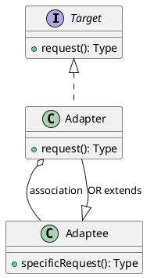

## 总结
### 概述
适配器模式通过中间层来转换接口，促进不同接口之间的协作，增强了系统的灵活性和可扩展性。
### 实现
```java
// 目标接口
public interface Target {
    void request();
}

// 被适配类
public class Adaptee {
    public void specificRequest() {
        // 具体实现
    }
}

// 对象适配器类
public class Adapter implements Target {
    private Adaptee adaptee;

    public Adapter(Adaptee adaptee) {
        this.adaptee = adaptee;
    }

    @Override
    public void request() {
        adaptee.specificRequest();
    }
}

// 类适配器（基于继承）
public class AdapterClass extends Adaptee implements Target {
    @Override
    public void request() {
        specificRequest();
    }
}
```
### 应用
- 需要使用现有的类，但其接口不符合需求
- 需要创建一个可以复用的类，用于与其他不兼容的类协同工作
- 当希望使用一些现有的子类，但不需要修改其源代码时

---
## 定义
- 将一个类的接口变换成客户端所期待的另一种接口, 从而使原本因接口不匹配而无法在一起工作的两个类能在一起工作
## 结构
- 目标接口
- 源类
- 适配器
## 原理类图


```java
// 目标接口
interface Translator {  
    public String translate();  
}

// 源类
public class Speaker {  
    public String speak()  
    {  
        return "你好世界";  
    }  
}

// 适配器
public class Adapter implements Translator {  
    private final Speaker speaker;  
  
    public Adapter(final Speaker speaker)  
    {  
        this.speaker = speaker;  
    }  
  
    @Override  
    public String translate()  
    {  
        String result = speaker.speak();  
        return result + "\nTranslated: Hello World!";  
    }  
}

// 实现适配
public class Main {  
    public static void main(String[] args)  
    {  
        System.out.println(new Adapter(new Speaker()).translate());
        /*输出:
        你好世界
Translated: Hello World!
        */
    }  
}
```
## 特点
### 优点
### 缺点