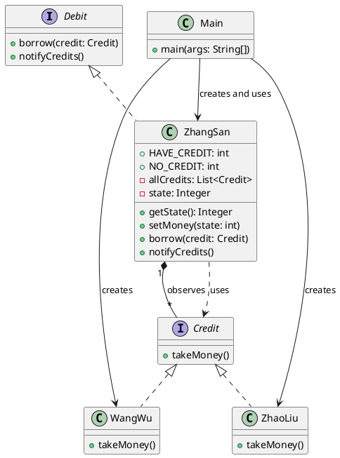

## 总结
### 概述
观察者模式通过主题和观察者的关系，实现了对象之间的松耦合。主题负责管理和通知观察者，观察者则响应主题的变化。
### 实现
```java
import java.util.ArrayList;
import java.util.List;

// 观察者接口
public interface Observer {
    void update(String message);
}

// 主题接口
public interface Subject {
    void registerObserver(Observer observer);
    void removeObserver(Observer observer);
    void notifyObservers();
}

// 具体主题
public class ConcreteSubject implements Subject {
    private List<Observer> observers = new ArrayList<>();
    private String message;

    public void setMessage(String message) {
        this.message = message;
        notifyObservers();
    }

    public void registerObserver(Observer observer) {
        observers.add(observer);
    }

    public void removeObserver(Observer observer) {
        observers.remove(observer);
    }

    public void notifyObservers() {
        for (Observer observer : observers) {
            observer.update(message);
        }
    }
}

// 具体观察者
public class ConcreteObserver implements Observer {
    private String name;

    public ConcreteObserver(String name) {
        this.name = name;
    }

    public void update(String message) {
        System.out.println(name + " received message: " + message);
    }
}

// 使用示例
public class Main {
    public static void main(String[] args) {
        ConcreteSubject subject = new ConcreteSubject();
        
        Observer obs1 = new ConcreteObserver("Observer1");
        Observer obs2 = new ConcreteObserver("Observer2");
        
        subject.registerObserver(obs1);
        subject.registerObserver(obs2);
        
        subject.setMessage("Hello Observers!");
        // 输出:
        // Observer1 received message: Hello Observers!
        // Observer2 received message: Hello Observers!
    }
}
```
### 应用
- 当一个对象的改变需要同时改变其他对象，而且不知道具体有多少对象需要改变时
- 需要建立一个触发机制，事件发生时自动通知相关对象
- 实现发布-订阅模式，例如事件管理系统、用户界面更新等

---
## 定义
- 对象间的一种**一对多**的依赖关系, 使得每当一个对象状态发生变化时, 其相关依赖对象皆得到通知并被自动更新
## 结构
- 被观察者接口
- 被观察者
- 观察者接口
- 观察者
## 原理类图


```java
// 定义被观察者行为  
interface Debit {  
    // 添加观察者  
    void borrow(Credit credit);  
  
    // 通知观察者  
    void notifyCredits();  
}

// 被观察者
import java.util.ArrayList;  
import java.util.List;  
  
public class ZhangSan implements Debit {  
    public static final int HAVE_CREDIT = 1;  
    public static final int NO_CREDIT = 0;  
  
    private final List<Credit> allCredits = new ArrayList<>();  
    private Integer state = NO_CREDIT;  
  
    public Integer getState()  
    {  
        return state;  
    }  
  
    public void setMoney(int state)  
    {  
        this.state = state;  
        if(this.state.equals(HAVE_CREDIT))  
        {  
            // 一旦有钱，通知所有贷款方  
            notifyCredits();  
        }  
    }  
  
    @Override  
    public void borrow(Credit credit)  
    {  
        allCredits.add(credit);  
    }  
  
    @Override  
    public void notifyCredits()  
    {  
        allCredits.forEach(Credit::takeMoney);  
    }  
}

// 定义观察者反馈行为  
interface Credit {  
    // 相应通知方法  
    void takeMoney();  
}

// 观察者1
public class WangWu implements Credit {  
    @Override  
    public void takeMoney()  
    {  
        System.out.println("王五拿钱");  
    }  
}

// 观察者2
public class ZhaoLiu implements Credit {  
    @Override  
    public void takeMoney()  
    {  
        System.out.println("赵六拿钱");  
    }  
}

// 客户端
public class Main {  
    public static void main(String[] args)  
    {  
        ZhangSan zhangSan = new ZhangSan();  
        zhangSan.borrow(new WangWu());  
        zhangSan.borrow(new ZhaoLiu());  
  
  		// 张三有钱了, 开始执行状态变化的方法, 即notifyCredits()
        zhangSan.setMoney(ZhangSan.HAVE_CREDIT);  
    }  
}
```
## 特点
- 动态响应: 观察者可以随时收到被观察者更新状态而自身更新
- 广播通信: 被观察者可以同时通知多个观察者, 实现一对多的通信关系