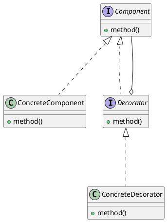

## 总结
### 概述
装饰器模式通过包装对象来扩展其功能，避免了子类的膨胀，提供了更灵活的对象组合方式
### 实现
```java
// 机器人接口
interface Robot {  
    void doSomething();  
}

// 具体机器人类
public class FirstRobot implements Robot {  
    @Override  
    public void doSomething() { }  
}

// 装饰器接口
interface Decorator {  
    void doMoreThing();  
}

// 机器人装饰器类
public class RobotDecorator implements Robot, Decorator {  
    private final Robot robot;  
    
    public RobotDecorator(final Robot robot) {  
        this.robot = robot;  
    }
    
    @Override  
    public void doSomething() { }  
    @Override  
    public void doMoreThing() { 
    	robot.doSomething();
    	// More
    }  
}

// 客户端代码示例
public class Main {
    public static void main(String[] args) {  
        Robot robot = new RobotDecorator(new FirstRobot());
        robot.doMoreThing()
	}
}
```
### 应用
- 需要在不改变对象自身的情况下，给对象添加额外的功能
- 需要动态地给一个对象添加职责，而不是通过继承
- 当需要扩展一个类的功能时，装饰器模式比生成子类更灵活

---
## 定义
- 动态地给一个对象添加一些额外的功能; 就增加功能来说, 装饰器模式比生成子类更为灵活
- 例
	- 一个机器人, 第一代会唱, 跳, rap
	- 第二代希望该机器人还会篮球
		- 方案一: 对第一代产品升级, 新增篮球功能
		- 方案二: 做一个篮球功能, 套在第一代产品上
	- 其中
		- 方案一是继承机制
			- 继承一个现有类, 并在子类进行扩展功能
		- 方案二是关联机制, 也就是装饰器模式
			- 将一个类的对象嵌入到另一个类的对象中
	- 对于继承机制来说, 方法是静态的, 一定要写一个新的子类, 对类层级进行扩展
	- 对于关联机制来说, 方法是动态的, 拿到一个对象就可以对其进行扩展, 不需要修改原有类逻辑
## 结构
- 构件接口
- 具体构件
- 装饰器接口
- 具体装饰器
## 原理类图


```java
// 构件接口
interface Robot {  
    void doSomething();  
}

//构件
public class FirstRobot implements Robot {  
    @Override  
    public void doSomething() {  
        System.out.println("唱");  
        System.out.println("跳");  
        System.out.println("rap");  
    }  
}

// 装饰器接口
interface Decorator {  
    void doMoreThing();  
}

// 装饰器
public class RobotDecorator implements Robot, Decorator {  
    private final Robot robot;  
  
    public RobotDecorator(final Robot robot)  
    {  
        this.robot = robot;  
    }  
  
    @Override  
    public void doSomething()  
    {  
        robot.doSomething();  
    }  
  
    @Override  
    public void doMoreThing()  
    {  
        robot.doSomething();  
        System.out.println("篮球");  
    }  
}

// 对构建进行装饰
public class Main {  
    public static void main(String[] args)  
    {  
        new RobotDecorator(new FirstRobot()).doMoreThing();  
    }  
}
```
## 特点
### 优点
- 增强灵活性: 动态扩展对象职责, 无需修改现有类, 不受层次结构限制, 避免了过多继承造成的过多类组合
- 遵循开闭原则, 无需修改现有类代码
- 单一职责原则: 将不同功能封装到不同装饰器中, 每个装饰器只负责一种功能的扩展
### 缺点
- 多层装饰难以管理, 降低代码可读性